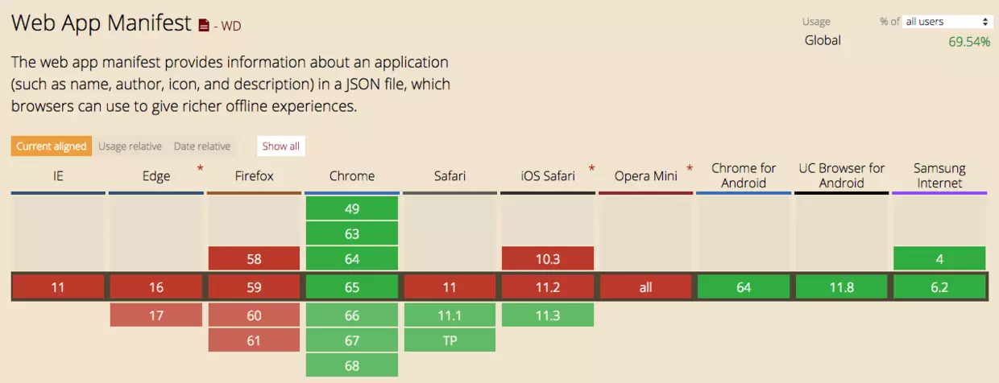

title: 渐进式 Web 应用（PWA）
speaker: Joel
prismTheme: dark
plugins:
    - mermaid

<slide class="bg-black-blue aligncenter" image="https://source.unsplash.com/C1HhAQrbykQ/ .dark">
:::{.content-right}
# PWA - 渐进式Web应用 {.text-shadow}

by Congyu Shen

[:fa-github: Github](https://shenjoel.github.io){.button.ghost}
[:fa-cloud-download: Demo](https://shenjoel.github.io/){.button.animated.fadeInUp}
:::
:::note
<p style="text-shadow: none; color: black">1、为什么会出现 PWA</p>
<p style="text-shadow: none; color: black">1.1、回顾一下历史，在 2015 年之前的那段时间，作为前端开发人员，我们主要精力花在哪里，对于我来说，移动站点的性能优化是投入精力很大的一部分，例如提升首屏速度，动画的流畅度，经过一段时间的优化，性能确实有不小的提升，但是无论怎么优化，还是比 Native App 要差很多，始终无法突破移动设备上 WebView 给 Web 的枷锁，这就是我们想说的第一个问题，Web 的用户体验。</p>
<p style="text-shadow: none; color: black">1.2、除开用户体验问题之外，还有一个非常重要的问题，那就是用户留存。Native App 安装完毕后会在用户手机桌面上有一个入口，让用户打开 App 只需一次点击，而 Web App 在移动时代最主要的入口还是搜索引擎，用户从浏览器到站点需要经过搜索引擎，如果想访问上次同样的内容甚至还需要记住上次的搜索词，用户也可以记住 URL 并进行输入，但这些对于移动用户来说，无疑成本巨大，这就导致 Web 站点和用户之间的粘性非常脆弱。Native App 还能够通过发送通知让用户再次回到应用中来，而 Web 没有这个能力。</p>
<p style="text-shadow: none; color: black">1.3、Device API 的不完善。Android 和 iOS 提供了非常丰富的设备 API，Native App 只需获取用户授权就可以使用，而在 Web App 中，WebView 没有提供这样的 API，完全没法使用，如果我们开发一个需要使用 NFC 的 App，你一定不会考虑 Web，因为近场通信 API 在 Web 中还没有。虽然在近年来，W3C 已经提出了很多新的标准，但是浏览器对于 Device API 的支持仍然很不完善。</p>
<p style="text-shadow: none; color: black">2、在开始之前，我们先来看看一个例子</p>
:::


<slide class="bg-black-blue aligncenter" image="https://source.unsplash.com/C1HhAQrbykQ/ .dark">
!
Web站点每个月的UV是Native App的`3 倍`，然而用户在Native App花费的时间却是Web的`20 倍`{.text-intro}
:::note
<p style="text-shadow: none; color: black">Google 在一篇名为《Why Build Progressive Web Apps》的文章中披露过这样的一组数据，Web 站点每个月的 UV 是 Native App 的 3 倍，然而用户在 Native App 花费的时间却是 Web 的 20 倍，如下图所示，这之间巨大的反差，和上面所说的三个原因息息相关。</p>
:::


<slide class="bg-black-blue" image="https://source.unsplash.com/C1HhAQrbykQ/ .dark">
:::{.content-right}
## 什么是PWA{.text-landing}
- Web App Manifest
- Service Worker
- Web Push
{.build.moveIn}
:::
:::note
<p style="text-shadow: none; color: black">Google 提出 PWA 的时候，并没有给它一个准确的定义，经过这么多年的实践和总结， PWA 它不是特指某一项技术，而是应用多项技术来改善用户体验的 Web App，其核心技术包括 Web App Manifest, Service Worker, Web Push 等，而这些技术都是围绕着提升用户体验进行，这就是 PWA 的核心。</p>
:::


<slide class="bg-black-blue" image="https://source.unsplash.com/C1HhAQrbykQ/ .dark">
:::header
### 添加到主屏幕 - 配置
:::
:::{.content-right}
### Manifest\:{.content-left}
```json
{
  "name": "Joel's blog",                --> 应用名
  "short_name": "Blog",                 --> 应用名缩写
  "icons": [{                           --> 展示在设备屏幕在图标
      "src": "./img/192x192.png",
      "sizes": "192x192",
      "type": "image/png",
      "purpose": "maskable"
    }, 
    {
      "src": "./img/512x512.png",
      "sizes": "512x512",
      "type": "image/png"
    }
  ],
  "start_url": "/index.html",           --> 打开的链接
  "background_color": "#ffffff",        --> 启动的背景色
  "display": "standalone",              --> 展示方式
  "theme_color": "#2874f0"              --> 主题色
  ...
}
```
{.build.moveIn}
:::
:::note
<p style="text-shadow: none; color: black">添加到主屏幕是现代浏览器中的一项功能，使开发人员可以轻松便捷地将自己喜欢的网络站点的快捷方式添加到主屏幕中，用户随后可以通过单击访问它。而刚才提到的 Web App Manifest，是一份web app的清单，用来配置添加主屏的入口文件，存放在要目录当中。</p>
:::


<slide class="bg-black-blue" image="https://source.unsplash.com/C1HhAQrbykQ/ .dark">
:::header
### 添加到主屏幕 - 安装
`<link rel="manifest" href="./manifest.json" />`
:::
!
!
:::note
<p style="text-shadow: none; color: black">配置好之后在主文档中引入文件，在浏览器地址栏会出现小图标，或是菜单项里会有安装选项，点击之后会有一个安装提示，确认后主屏幕上会新增一个配置好的图标，也是当前web app的入口，实际的开发中自己去实现安装的UI，通过API去完成安装，那么到这里主屏添加的功能就已经实现了。</p>
:::


<slide class="bg-black-blue" image="https://source.unsplash.com/C1HhAQrbykQ/ .dark">
:::header
### 添加到主屏幕 - [:fa-link:](https://shenjoel.github.io/)清单检查{.text-intor}
:::
!
:::note
<p style="text-shadow: none; color: black">清单配置项可以通过Chrome控制台查看是否正确</p>
:::


<slide class="bg-black-blue" image="https://source.unsplash.com/C1HhAQrbykQ/ .dark">
:::header
### Manifest 属性值兼容性
:::
<div style="width: 1200px; height: 700px; overflow: auto;">
	
</div>
:::note
<p style="text-shadow: none; color: black">不同的系统和浏览器的兼容情况也是大不相同，移动端Android Chrome的支持是最完整的，在桌面端Chrome和Edge也是支持比较好的，当然在移动端的体验是最好，甚至提供了与原生APP一至的在，打开应用时的入场动效，单独的浏览容器，那我们来看下实际的交互场景是怎样的（转Demo）</p>
:::


<slide class="bg-black-blue" image="https://source.unsplash.com/C1HhAQrbykQ/ .dark">
:::header
### Service Worker
:::
:::shadowbox

## 代理层
Service Worker 是浏览器和网络之间的虚拟代理

---

## 独立工作线程
不同于页面主线程，独立运行在另一个工作线程上，它无权访问 DOM 结构
:::


:::note
<p style="text-shadow: none; color: black">Service Worker 是浏览器和网络之间的虚拟代理</p>

<p style="text-shadow: none; color: black">不同于页面主线程，独立运行在另一个工作线程上，它无权访问 DOM 结构</p>

<p style="text-shadow: none; color: black">早在 2014 年 5 月 W3C 就提出了 Service Worker 草案，用来进行 Web 资源和请求的持久离线缓存。Service Worker 的来历可以从两个方面来介绍。</p>
:::


<slide class="bg-black-blue" image="https://source.unsplash.com/C1HhAQrbykQ/ .dark">
:::header
### Service Worker
:::
:::shadowbox

## 释放主线程的性能压力
将复杂的耗时的工作脱离主线程执行，释放在主线程的性能耗时。

---

## 持久离线缓存能力
可以通过自身的生命周期特性保证复杂的工作只处理一次，并持久缓存处理结果，直到修改了 Service Worker 的内在的处理逻辑。
:::

:::note
<p style="text-shadow: none; color: black">一方面，浏览器中的 JavaScript 是运行在一个单一主线程上的，在同一时间内只能做一件事情。随着 Web 业务不断复杂，在 JavaScript 中的代码逻辑中往往会出现很多耗资源、耗时间的复杂运算过程。这些过程导致的性能问题在 Web App 日益增长的复杂化过程中更加凸显出来。所以 W3C 提出了 Web Worker API 来专门解放主线程，Web Worker 是脱离在主线程之外的工作线程，开发者可以将一些复杂的耗时的工作放在 Web Worker 中进行，工作完成后通过 postMessage 告诉主线程工作的结果，而主线程通过 onmessage 得到 Web Worker 的结果反馈，从而释放了主线程的性能压力。</p>

<p style="text-shadow: none; color: black">代码执行性能问题好像是解决了，但 Web Worker 是临时存在的，每次做的事情的结果不能被持久存下来，如果下次访问 Web App 同样的复杂工作还是需要被 Web Worker 重新处理一遍，这同样是一件消耗资源的事情，只不过不是在主线程消耗罢了。那能不能有一个 Worker 线程是一直可以持久存在的，并且随时准备接受主线程的命令呢？基于这样的需求 W3C 推出了最初版本的 Service Worker，Service Worker 在 Web Worker 的基础上加上了持久离线缓存能力，可以通过自身的生命周期特性保证复杂的工作只处理一次，并持久缓存处理结果，直到修改了 Service Worker 的内在的处理逻辑。</p>

<p style="text-shadow: none; color: black">让我们简单了解一下 Service Worker 生命周期的工作原理</p>
:::


<slide class="fullscreen bg-black-blue" image="https://source.unsplash.com/C1HhAQrbykQ/ .dark">
:::header
### Service Worker - lifecycle
:::

:::column
!

---

:::{.fadeInRight}
- 1、在主线程成功注册 Service Worker 之后，开始下载并解析执行 Service Worker 文件，执行过程中开始安装 Service Worker，在此过程中会触发 worker 线程的 install 事件。{.bg-primary}

- 2、如果 install 事件回调成功执行（在 install 回调中通常会做一些缓存读写的工作，可能会存在失败的情况），则开始激活 Service Worker，在此过程中会触发 worker 线程的 - activate 事件，如果 install 事件回调执行失败，则生命周期进入 Error 终结状态，终止生命周期。{.bg-primary}

- 3、完成激活之后，Service Worker 就能够控制作用域下的页面的资源请求，可以监听 fetch 事件。{.bg-primary}

- 4、如果在激活后 Service Worker 被 unregister 或者有新的 Service Worker 版本更新，则当前 Service Worker 生命周期完结，进入 Terminated 终结状态。{.bg-primary}
{.build}
:::

:::

:::{.build.fadeInRight.aligncenter}
#### `通过 Service Worker 让 PWA...?`
:::

:::note
<p style="text-shadow: none; color: black">1、在主线程成功注册 Service Worker 之后，开始下载并解析执行 Service Worker 文件，执行过程中开始安装 Service Worker，在此过程中会触发 worker 线程的 install 事件。</p>

<p style="text-shadow: none; color: black">2、如果 install 事件回调成功执行（在 install 回调中通常会做一些缓存读写的工作，可能会存在失败的情况），则开始激活 Service Worker，在此过程中会触发 worker 线程的 - activate 事件，如果 install 事件回调执行失败，则生命周期进入 Error 终结状态，终止生命周期。</p>

<p style="text-shadow: none; color: black">3、完成激活之后，Service Worker 就能够控制作用域下的页面的资源请求，可以监听 fetch 事件。</p>

<p style="text-shadow: none; color: black">4、如果在激活后 Service Worker 被 unregister 或者有新的 Service Worker 版本更新，则当前 Service Worker 生命周期完结，进入 Terminated 终结状态。</p>

<p style="text-shadow: none; color: black">通过 Service Worker 让 PWA...?</p>
:::


<slide class="bg-black-blue" image="https://source.unsplash.com/C1HhAQrbykQ/ .dark">
:::header{.alignright}
### Service Worker - 预缓存资源
:::

:::column
#### 在安装过程中缓存资源


---

<div style="height: 800px; overflow: auto;">

```js
// 缓存的key
const cacheName = 'joelblog-sorce-v0.0.2';

// 保存到本地cache的文件路径
const filesToCache = ['/', '/index.html', '/css/xx.css', '/js/xx.js', ...];

// 安装
self.addEventListener('install', function(e) {
	console.log('[ServiceWorker] Install');

	e.waitUntil(
		caches.open(cacheName).then(function(cache) {
			console.log('[ServiceWorker] Caching app shell');
			return cache.addAll(filesToCache);
		})
	);
});
```

</div>

:::

:::note
<p style="text-shadow: none; color: black">首先我们在 install 的监听函数中，利用Caches api 把定义好的资源列表缓存起来，完成安装以后，Service进入激活状态。</p>
:::

<slide class="bg-black-blue" image="https://source.unsplash.com/C1HhAQrbykQ/ .dark">
:::header
### Service Worker - 拦截代理
:::

:::column
#### 在安装过程中缓存资源


---

<div style="height: 800px; overflow: auto;">

```js
// 拦截请求
self.addEventListener('fetch', function(e) {
	console.log('[Service Worker] Fetch', e.request.url);

	e.respondWith(
		caches.match(e.request).then((response) => {
			return response || fetch(e.request);
		}),
	);
});
```

</div>

:::

:::note
<p style="text-shadow: none; color: black">当用户再次访问页面时，fetch 事件会拦截请求，只要匹配到缓存的key，优先返回缓存的内容，如果没有会拉取服务端数据返回</p>

<p style="text-shadow: none; color: black">目前demo本地存储管理，使用的是caches api</p>

<p style="text-shadow: none; color: black">Cache API 是为资源请求与响应的存储量身定做的，它采用了键值对的数据模型存储格式，以请求对象为键、响应对象为值，正好对应了发起网络资源请求时请求与响应一一对应的关系。因此 Cache API 适用于请求响应的本地存储。</p>

<p style="text-shadow: none; color: black">IndexedDB 则是一种非关系型（NoSQL）数据库，它的存储对象主要是数据，比如数字、字符串、Plain Objects、Array 等，以及少量特殊对象比如 Date、RegExp、Map、Set 等等，对于 Request、Response 这些是无法直接被 IndexedDB 存储的。</p>

<p style="text-shadow: none; color: black">缓存策略</p>
<ul style="text-shadow: none; color: black">
	<li>NetworkFirst：网络优先</li>
	<li>CacheFirst：缓存优先</li>
	<li>NetworkOnly：仅使用正常的网络请求</li>
	<li>CacheOnly：仅使用缓存中的资源</li>
	<li>StaleWhileRevalidate：从缓存中读取资源的同时发送网络请求更新本地缓存</li>
</ul>
:::
